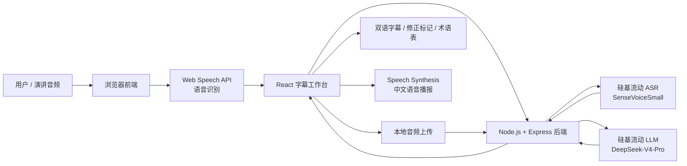
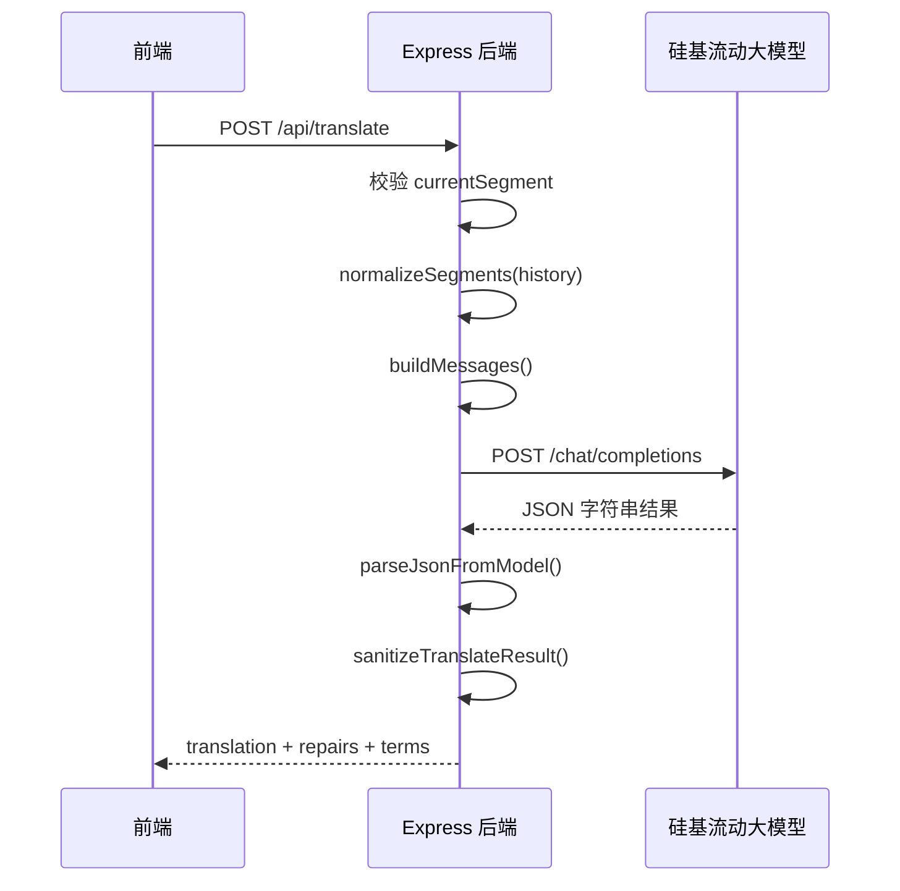
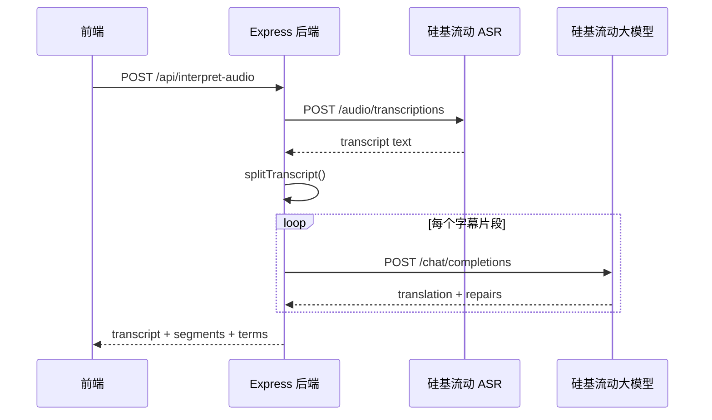

# AI 同声传译助手项目说明文档

## 1. 项目概述

本项目实现的是一个“AI 同声传译助手”。它面向观看英文演讲、国际会议、技术分享、网课等场景，帮助用户把外语音频内容实时转换为中文字幕，从而降低语言理解门槛。

系统的核心目标有三个：

1. 实时性：尽量在说话人完成一个短句后立即生成中文译文。
2. 可读性：以双语字幕流的方式展示原文、译文、延迟、置信度和修正状态。
3. 可修正性：当后续上下文证明前面的识别或翻译存在错误时，系统可以自动修正历史字幕。

当前项目已接入硅基流动的大模型 API：

```text
Base URL: https://api.siliconflow.cn/v1
Model: deepseek-ai/DeepSeek-V4-Pro
ASR Model: FunAudioLLM/SenseVoiceSmall
```

API Key 只放在本地 `.env` 文件中，说明文档和 README 中不保存真实密钥。

## 2. 整体架构

项目采用前后端分离架构：



整体流程如下：

1. 用户点击前端页面的“开始”按钮。
2. 浏览器调用麦克风权限，通过 Web Speech API 将外语音频识别为文本。
3. 前端把识别出的最终片段发送给后端 `/api/translate`。
4. 后端携带当前片段和最近历史字幕，请求硅基流动大模型接口。
5. 大模型返回当前译文、置信度、术语和可能需要修正的历史字幕。
6. 前端展示新字幕，并根据 `repairs` 字段回写修正旧字幕。
7. 如果用户开启中文语音播报，前端会用 Speech Synthesis API 朗读中文译文。

除实时麦克风模式外，系统还支持上传本地音频文件。上传模式会先调用硅基流动 `/audio/transcriptions` 接口完成转写，再把完整转写文本切分成多个字幕片段，逐段调用翻译链路生成中文字幕。

## 3. 技术栈及作用

| 技术 | 所在位置 | 作用 |
| --- | --- | --- |
| React 19 | 前端 | 构建字幕工作台界面，管理字幕列表、监听状态、错误提示、术语表等 UI 状态 |
| TypeScript | 前端 | 为字幕数据、接口返回、语音识别对象等提供类型约束，降低开发错误 |
| Vite | 前端工程化 | 提供快速开发服务器、热更新、构建打包能力，并代理 `/api` 请求到后端 |
| lucide-react | 前端 UI | 提供按钮和状态图标，例如麦克风、停止、复制、音量、警告等 |
| Web Speech API | 浏览器能力 | 使用 `SpeechRecognition` 实现麦克风语音识别 |
| 硅基流动 ASR | 后端 AI 能力 | 使用 `FunAudioLLM/SenseVoiceSmall` 对上传音频进行转写 |
| Speech Synthesis API | 浏览器能力 | 使用浏览器内置语音合成能力播报中文译文 |
| Node.js | 后端运行时 | 运行 Express 服务，承接前端请求并调用大模型 API |
| Express | 后端框架 | 提供 `/api/config`、`/api/health`、`/api/translate` 等接口 |
| dotenv | 后端配置 | 从 `.env` 文件读取大模型 Key、模型名、Base URL、代理地址等配置 |
| undici | 后端请求 | 调用硅基流动 OpenAI-compatible API，并支持代理 |
| ProxyAgent | 后端网络 | 解决 Windows 环境下 Node.js 不自动走系统代理的问题 |
| concurrently | 开发工具 | 一条命令同时启动后端 Express 服务和前端 Vite 服务 |

## 4. 目录结构说明

```text
D:\XEgineer
├─ server
│  └─ index.js                 后端服务入口，大模型调用与接口处理
├─ src
│  ├─ App.tsx                  前端主页面，语音识别、字幕状态和交互逻辑
│  ├─ App.css                  页面样式
│  ├─ main.tsx                 React 应用入口
│  └─ speech-recognition.d.ts  Web Speech API 类型声明
├─ .env                        本地真实配置，包含 API Key，不提交、不写入文档
├─ .env.example                环境变量模板
├─ README.md                   快速运行说明
├─ 项目说明文档.md             当前说明文档
├─ package.json                依赖与脚本
├─ tsconfig.json               TypeScript 配置
├─ vite.config.ts              Vite 配置与接口代理
└─ index.html                  前端 HTML 入口
```

## 5. 前端架构说明

前端核心文件是 `src/App.tsx`。

### 5.1 页面组成

前端页面分为两个主要区域：

1. 主字幕区：展示运行状态、实时识别中的临时文本、最终字幕列表。
2. 侧边控制区：展示片段数、修正数、平均延迟、手动测试输入框和术语表。

主要功能包括：

- 选择输入语言。
- 开始或停止麦克风监听。
- 开启或关闭中文语音播报。
- 上传本地音频并自动传译。
- 复制字幕记录。
- 清空字幕流。
- 手动输入外语文本测试翻译链路。

### 5.2 字幕数据结构

前端用 `Segment` 表示一条字幕：

```ts
type Segment = {
  id: string;
  sourceText: string;
  translatedText: string;
  status: 'translating' | 'done' | 'corrected' | 'error';
  confidence?: number;
  correctionReason?: string;
  latencyMs?: number;
  createdAt: number;
};
```

其中：

- `sourceText` 保存外语原文。
- `translatedText` 保存中文译文。
- `status` 表示字幕状态。
- `confidence` 表示模型给出的置信度。
- `correctionReason` 表示历史字幕被修正的原因。
- `latencyMs` 用于展示翻译延迟。

### 5.3 语音识别流程

前端通过以下方式启动浏览器语音识别：

1. 获取 `window.SpeechRecognition` 或 `window.webkitSpeechRecognition`。
2. 设置 `continuous = true`，让识别持续进行。
3. 设置 `interimResults = true`，获取临时识别结果。
4. 在 `onresult` 事件中区分临时结果和最终结果。
5. 对最终结果调用 `translateSegment()`，发送给后端翻译。

临时识别结果会显示在“等待音频输入 / 正在听取音频”区域；最终结果会进入字幕列表。

### 5.4 前端翻译请求流程

`translateSegment()` 的主要步骤：

1. 生成当前片段 ID。
2. 先在页面上插入一条状态为 `translating` 的字幕。
3. 从当前字幕列表中取最近 8 条历史字幕作为上下文。
4. 调用后端 `/api/translate`。
5. 收到结果后更新当前字幕为 `done`。
6. 如果结果中包含 `repairs`，按 ID 更新历史字幕为 `corrected`。
7. 如果结果中包含 `terms`，更新侧边栏术语表。
8. 如果开启语音播报，朗读中文译文。

### 5.5 音频上传传译流程

上传音频功能位于侧边栏“上传音频”区域。

前端处理流程：

1. 用户选择本地音频文件。
2. 前端使用 `FormData` 封装文件、输入语言和目标语言。
3. 调用后端 `/api/interpret-audio`。
4. 后端返回完整转写文本、字幕片段和术语表。
5. 前端用返回的 `segments` 替换当前字幕流。
6. 前端把完整转写文本显示到实时文本区域，方便核对。

该功能适合处理已经录制好的网课、会议录音、演讲音频或短视频提取音频。

## 6. 后端架构说明

后端核心文件是 `server/index.js`，基于 Express 实现。

### 6.1 后端接口

#### GET `/api/config`

返回当前模型配置状态，用于前端显示“API 已配置”等信息。

示例：

```json
{
  "model": "deepseek-ai/DeepSeek-V4-Pro",
  "baseUrl": "https://api.siliconflow.cn/v1",
  "hasApiKey": true,
  "hasProxy": true
}
```

#### GET `/api/health`

用于服务健康检查，返回后端是否正常启动以及当前配置状态。

#### POST `/api/translate`

核心翻译接口。请求体包含：

- `sourceLanguage`：输入语言，例如 `en-US`。
- `targetLanguage`：目标语言，当前固定为 `zh-CN`。
- `currentSegment`：当前需要翻译的片段。
- `history`：最近历史字幕，用于上下文纠错。

#### POST `/api/interpret-audio`

音频上传传译接口。请求类型为 `multipart/form-data`。

字段包括：

- `audio`：上传的音频文件。
- `sourceLanguage`：输入语言。
- `targetLanguage`：目标语言，当前使用 `zh-CN`。

后端处理步骤：

1. 使用 `multer` 在内存中接收音频文件。
2. 调用硅基流动 `/audio/transcriptions` 接口转写音频。
3. 使用 `splitTranscript()` 将完整转写文本切分为字幕片段。
4. 按顺序调用现有翻译逻辑，并携带历史上下文。
5. 汇总所有字幕片段、修正结果和术语表后返回前端。

### 6.2 大模型调用流程

后端处理一次翻译请求的流程如下：



上传音频链路如下：



### 6.3 Prompt 设计

后端通过 `buildMessages()` 构造消息，要求模型扮演同声传译引擎，并返回严格 JSON。

模型需要返回：

- `id`：当前片段 ID。
- `sourceText`：清理或轻微纠正后的原文。
- `translation`：当前片段中文译文。
- `confidence`：置信度。
- `repairs`：需要修正的历史字幕。
- `terms`：重要术语对照。

后端明确要求模型：

- 译文要适合实时字幕，不要过长。
- 使用中文标点。
- 不要编造原文没有的信息。
- 只有在上下文明确证明错误时才修正历史字幕。
- 只能修正 `history` 中真实存在的 ID。

### 6.4 结果清洗与安全处理

大模型虽然被要求返回 JSON，但实际返回可能带有 Markdown 代码块或额外文本。因此后端实现了：

- `cleanModelJson()`：去掉可能存在的 ```json 代码块。
- `parseJsonFromModel()`：优先直接解析 JSON，失败后尝试截取 `{...}`。
- `sanitizeTranslateResult()`：限制字段长度、过滤不存在的修正 ID、限制修正数量和术语数量。

这样可以减少模型输出格式不稳定对前端造成的影响。

## 7. 自动纠错机制

题目要求系统具备修正能力，能够自动纠正之前识别或翻译的错误。本项目通过“历史上下文 + repairs 回写”实现。

### 7.1 为什么需要纠错

实时语音识别和翻译存在天然不确定性，例如：

- 语音识别把专业术语听错。
- 一句话被切成多个片段，前半句上下文不足。
- 模型一开始不知道某个缩写或人名的含义。
- 后续内容证明前面翻译的语义方向不准确。

### 7.2 如何实现纠错

每次请求 `/api/translate` 时，前端会附带最近 8 条历史字幕：

```json
{
  "history": [
    {
      "id": "seg-1",
      "sourceText": "previous source",
      "translatedText": "previous translation"
    }
  ]
}
```

后端把这些历史字幕放进 prompt，让模型判断是否需要修正。如果需要，模型返回：

```json
{
  "repairs": [
    {
      "id": "seg-1",
      "sourceText": "corrected source",
      "translation": "修正后的中文译文",
      "reason": "根据后续上下文修正术语"
    }
  ]
}
```

前端收到后会：

1. 找到对应 `id` 的旧字幕。
2. 替换原文或译文。
3. 将状态改为 `corrected`。
4. 显示修正原因。

这样就完成了“实时生成 + 后续修正”的字幕体验。

## 8. 代理与网络设计

在 Windows 环境下，浏览器和 PowerShell 可能能正常访问外网，但 Node.js 的 `fetch` 不一定自动走系统代理。为了解决这个问题，后端支持 `LLM_PROXY_URL`。

当前推荐配置：

```env
LLM_PROXY_URL=http://127.0.0.1:7890
```

后端使用：

```js
import { fetch as undiciFetch, ProxyAgent } from 'undici';
```

音频上传接口同样复用这套代理能力，因此转写请求和翻译请求都会走同一个代理配置。

当检测到 `LLM_PROXY_URL`、`HTTPS_PROXY` 或 `HTTP_PROXY` 时，会创建 `ProxyAgent`，并在请求硅基流动 API 时使用该代理。

这样可以避免常见的：

```text
fetch failed
Connect Timeout Error
```

## 9. 搭建过程

### 9.1 初始化项目

项目放在：

```text
D:\XEgineer
```

使用 Vite + React + TypeScript 作为前端基础，后端使用 Express 单独提供 API。

### 9.2 安装依赖

```bash
npm.cmd install
```

主要依赖：

```text
react
react-dom
vite
typescript
express
dotenv
cors
undici
concurrently
lucide-react
```

### 9.3 配置 TypeScript

项目使用 `tsconfig.json` 管理 TypeScript 编译选项。

其中 `moduleResolution` 使用：

```json
"moduleResolution": "Bundler"
```

这更符合 Vite 这类现代前端打包工具的模块解析方式。

### 9.4 配置 Vite 代理

`vite.config.ts` 中配置了开发代理：

```ts
server: {
  port: 5173,
  proxy: {
    '/api': {
      target: 'http://localhost:8787',
      changeOrigin: true
    }
  }
}
```

这样前端请求 `/api/translate` 时，会由 Vite 转发到后端 `http://localhost:8787/api/translate`，避免跨域和端口不一致带来的问题。

### 9.5 配置环境变量

复制 `.env.example` 为 `.env`：

```bash
copy .env.example .env
```

填写硅基流动配置：

```env
PORT=8787
LLM_BASE_URL=https://api.siliconflow.cn/v1
LLM_MODEL=deepseek-ai/DeepSeek-V4-Pro
LLM_API_KEY=你的硅基流动 API Key
ASR_MODEL=FunAudioLLM/SenseVoiceSmall
LLM_TEMPERATURE=0.2
LLM_TIMEOUT_MS=30000
LLM_PROXY_URL=http://127.0.0.1:7890
```

### 9.6 启动服务

```bash
npm.cmd run dev
```

这个命令会通过 `concurrently` 同时启动：

```text
node server/index.js
vite --host 0.0.0.0
```

访问地址：

```text
http://localhost:5173
```

## 10. 构建与验证

### 10.1 构建命令

```bash
npm.cmd run build
```

构建过程包括：

1. TypeScript 类型检查。
2. Vite 前端构建。
3. 生成 `dist` 静态资源目录。

### 10.2 接口验证

检查后端配置：

```text
GET http://localhost:8787/api/config
```

预期返回：

```json
{
  "model": "deepseek-ai/DeepSeek-V4-Pro",
  "baseUrl": "https://api.siliconflow.cn/v1",
  "hasApiKey": true,
  "hasProxy": true
}
```

测试翻译：

```text
hello, welcome to this technical talk.
```

已验证返回：

```text
你好，欢迎参加本次技术讲座。
```

## 11. 当前实现的优点

- 前后端职责清晰，便于后续扩展。
- 使用 OpenAI-compatible 接口，方便切换不同大模型服务商。
- 支持硅基流动 DeepSeek 模型。
- 兼容 Windows 本地代理环境。
- 前端界面包含实时字幕、历史修正、术语表和语音播报。
- 手动输入区域方便在没有麦克风或演示环境受限时测试。
- 后端对模型输出做了 JSON 清洗和字段限制，稳定性更高。

## 12. 可扩展方向

后续可以继续扩展：

1. 接入真正的音频流 ASR 服务，替代浏览器 Web Speech API。
2. 使用 WebSocket 实现更低延迟的流式字幕。
3. 将大模型返回改为流式输出，减少等待时间。
4. 增加字幕导出功能，例如导出 SRT、VTT 或 Markdown。
5. 增加会议模式，支持保存多个会话。
6. 增加术语表预设，让用户提前配置专业词汇。
7. 增加目标语言选择，不只翻译成中文。
8. 增加用户登录和历史记录云端存储。

## 13. 总结

本项目完成了一个具备实时识别、AI 翻译、字幕展示、历史纠错和语音播报能力的同声传译助手。前端负责音频识别和交互呈现，后端负责安全地调用大模型并处理上下文修正逻辑，大模型负责生成中文译文和修正建议。

整体实现既满足题目要求，也保留了较好的可扩展性，后续可以继续向更低延迟、更稳定 ASR、更完整会议记录方向升级。
