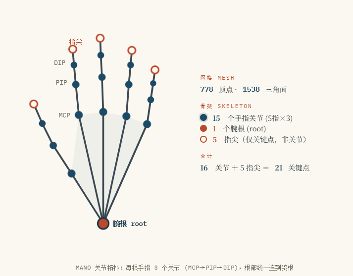

# 参数化手部模型:MANO

## 1.简述

MANO是**手部版的SMPL:一个可微的参数化三角网格模型。**它用一组很短的参数向量，就能确定一只手的**完整三维形态**--既包括“这是谁的手”(胖瘦大小)，也包括"这只手此刻摆成什么样"(每根手指弯成什么角度)。

## 2.构成

MANO是一张有**拓扑结构的可形变网络**，下面挂着一副关节骨架。网格作为“皮”，负责外形可视和渲染，骨架作为“骨”，负责怎么弯。



**腕根是所有手指的父节点，手指上的关节一节套一节。弯手指在数学上就是旋转这些关节**

## 2.参数：动作和身份(θ)

MANO把一只手拆成两组互不相干的参数，一组管**这只手在做什么**，一组管**这是谁的手**。

### 2.1姿态关节(在做什么)

### 2.1.1 轴角

- 每个关节的旋转用**轴角(axis-angle)**表示，一个关节3个数。

  MANO把**轴和角度压缩到一个3维向量**里，pose参数中的每个关节的3个数就是轴角向量的三个分量。
  $$
  \textbf{v}=(v_x,v_y,v_z)\in \mathbf{R}^3
  $$
  解码方式是：

  - **旋转轴**=向量方向：
    $$
    \mathbf{a}=\frac{\mathbf{v}}{||\mathbf{v}||}
    $$

  - **旋转角度**=向量模长：
    $$
    \theta=||\mathbf{v}||
    $$

  - 特殊情况:**v**=(0,0,0)表示该关节无旋转(角度为0时轴无定义)

    所以对于手指关节来说，共15×3=45维

- 对于腕根root做整只手的全局旋转，通过**Rodrigues公式**把这个向量转成3×3矩阵，再作用于 rest pose 上的关节做 forward kinematics。**腕根也是解码成“旋转轴+旋转角度”**

- 得到旋转轴和旋转角度的下一步是使用**Rodrigues公式**构造出3×3旋转矩阵，步骤是：

  ```
  3 个数 (0,0,1.57)
     │  模长 → θ；单位化 → k          （平凡的向量运算）
     ▼
  (轴 k=(0,0,1),  角度 θ=1.57)
     │  Rodrigues 公式                （唯一叫"公式"的一步）
     ▼
  3×3 旋转矩阵 R
     │  放进 FK 链                     （"全局"在这一步产生）
     ▼
  整只手的姿态
  ```

  $$
  \mathbf{R}=\mathbf{I}+sin\theta\mathbf{K}+(1-cos\theta)\mathbf{K}^2,K=
  \begin{bmatrix}
  0&-k_z&k_y\\
  k_z&0&-k_x\\
  -k_y&k_x&0
  \end{bmatrix}
  $$

- FK的代码骨架

  ```
  R = [cv2.Rodrigues(pose[j]) for j in range(16)]   # 每个关节一个 R，root 无特殊处理
  for j in range(16):
      parent = kintree_table[0][j]
      if parent == -1:                              # 只有 root 走这个分支
          G[j] = [ R[j] |  J[j]           ]         # 平移就是自己关节的位置
      else:
          G[j] = G[parent] @ [ R[j] |  J[j] - J[parent] ]   # 左乘父亲的全局变换
  ```

  `G` 就是 global（全局）变换的缩写。**为什么根的 R 会变成全手的旋转？** 用最小的两关节例子算一遍——根转 90°（R₀），手指关节不转（R₁ = I）：
  $$
  G_1=\underbrace{[R0∣t0]}_{根的全局变换}⋅\underbrace{[I∣d]}_{孩子的相对变换}=[ R_0 ∣  R_0\mathbf{d}+t_0 ]
  $$

​	孩子的全局变换里**最左边的因子是 R₀**——孩子相对父亲的偏移 d 被 R₀ 带着转。再往下，孙子的 	G 里 R₀ 还在最左侧，一路乘下去，最后 LBS 蒙皮时每个顶点位置都是各关节 G 的加权组合：
$$
\mathbf{v}'=\sum_jw_jG_j\mathbf{v}
$$
​	所以：

​	1.**改腕根那 3 个数** → R₀ 变 → 所有 16 个 G 的最左因子变 → **778 个顶点整体转动**，这就是“全局	旋转”的全部实现机制；

​	2.**改某个手指关节的 3 个数** → 它的 R 只出现在自己下游子树的 G 里 → 只有那根手指动。

### 2.1.2 全局平移

- **轴角只编码“绕哪个轴、转多少角度”，本身没有平移分量，对于平移通过腕部root的全局平移trans三维向量决定**

​	`trans=(tx,ty,tz)`就是字面意义的3维偏移(MANO的单位是米)，**trans不需要Rodrigues，不进FK链**

- **实现位置：LBS之后、投影之前**

​	smplx前向代码的骨架(以下代码在`mano_layer`内)：

```
# 1. 造型 + 姿态 + 蒙皮，全部在"模型坐标系"里完成
#    此时手的腕根大致在原点附近，手摆好姿势但位置固定
verts, joints = lbs(betas, full_pose, v_template, ...)   # LBS 输出

# 2. 平移是最后一步的纯加法
if transl is not None:
    verts  = verts  + transl
    joints = joints + transl
```

效果：模型先把“手的形状和姿势”算完（腕根在模型坐标系原点），`trans` 再把整只手**平移拷贝**到目标位置——每个顶点加同一个向量，姿势和形状完全不变。腕根原在 (0,0,0)，加 `trans=(0.1, 0.2, 0.3)` 后就在 (0.1,0.2,0.3)，全部顶点跟着挪。

> [!IMPORTANT]
>
> **verts(vertices,顶点)---手的表面**
> 	1.778个3D点，形状`[778,3]`,是由1538个三角形面片(`faces:[1538,3]`，存的是顶点索引)连成**手的三维网格(mesh)**
>
> ```
> verts = [[x0,y0,z0],   # 0 号点
>          [x1,y1,z1],   # 1 号点
>          ...
>          [x777,y777,z777]]      # 形状 [778, 3]，存 3D 坐标 → "几何"
> 
> faces = [[0, 1, 250],  # 这个三角形 = 用 0、1、250 号点连成
>          [1, 251, 250],
>          ...]                   # 形状 [1538, 3]，存索引 → "拓扑"
> ```
>
> ​	2.`betas`(形状)、`pose`(姿势)、LBS蒙皮的所有计算最终都落在**这778个点**上：指甲的弧度、指节的粗细、掌心的凹陷都由它们表达；
>
> ​	3.**用途：渲染出手图像、计算手与物体的接触/穿透、法向量和深度图。**
>
> **joints(关节)---手的骨架关键点**
>
> ​	1.**骨架关键点**，常见[21,3]:
>
> ​		**16个骨骼关节**=手腕(root)+15个手指关节(每根手指3个)--就是前面FK链里的那16个节点
>
> ​		**5个指节点**：MANO内部骨架其实没有指尖，常用的21关节格式是额外用一个小回归矩阵**从778个顶点里线性组合出5个指尖**(`use_extra_joints=True`时返回)
>
> ​	2.**用途：与2D/3D关键点标注做监督、算MPJPE/PA-MPJPE等评测指标、驱动抓取分析的接触点**
>
> 两者的关系
>
> ```
> 778 个 verts（稠密表面）
>    │  J_regressor（16×778 矩阵）      每个关节 = 若干顶点的加权平均
>    ▼
> 16 个骨架 joints（稀疏骨骼点）
>    │  额外的指尖回归
>    ▼
> 21 joints（常用关键点格式）
> ```
>
> - **joints 是 verts 的稀疏“摘要”**：骨骼关节位置就是把 mesh 顶点按 `J_regressor` 加权求和得到的，FK/LBS 时两者用同一套全局变换 `G` 蒙皮，永远保持相对一致；
>
> - 前面说的 `trans` 平移是**两者一起加**——一个动全都动，它们始终是同一只手的两种采样。
>
>   `mano_layer`的使用如下
>
>   ```
>   output = mano_layer(betas=betas, global_orient=go, hand_pose=hp, transl=trans)
>   output.vertices   # [B, 778, 3]  手的网格表面
>   output.joints     # [B, 21, 3]   21 个关键点（或 16，取决于配置）
>   ```

- `trans`来源

​	1.**优化**：给定目标关节位置**p**，直接闭式解(只差一个平移)
$$
trans=\mathbf{p}-J_{root}^{model}
$$
​	2.**相机投影**：2D对齐时`trans`和弱透视/透视相机参数一起优化，把投影后的关键点拉到检测框上；

​	3.**网络回归**：有些方法直接回归`trans`，有些只回归pose，trans由后处理对齐得到。

hamer等重建框架是相机(scale+translation)和模型`transl`配合使用的代码，本质都是这3个自由度在不同坐标系间的匹配。

**一句话总结**：`trans` 不经过任何公式变换，就是 LBS 算完姿势后，对顶点和关节整体加上一个 3 维向量；它和 `global_orient` 合起来才是完整的手部全局位姿（SE(3) = 3 旋转 + 3 平移）。

### 3.形状/身份--这是谁的手(β)

- 手的**形态**：大小、胖瘦、手指长短比例

- **10个PCA系数**，从大量真人手部扫描学出来

- person-specific:同一只手**通常固定不变**

- 做动作建模时一般**锁死**，不当作动作

  ### 3.1 10个PCA系数的具体含义

  MANO的shape空间是把几十名受试者的手摆成固定姿势扫描，把每次扫描都配准到同一张模板网格上，于是每次扫描变成一个“逐顶点偏移量”长向量。把这些向量堆成数据矩阵做 **PCA（主成分分析）**，取方差最大的前 10 个主方向——就是 `shapedirs`
  $$
  数据矩阵\to^{PCA}shapedirs([778\cdot3,10]列)+v_{template}(平均手)
  $$
  每个主方向本身是一个**778个顶点的位移场**，10个方向按解释性的方差**从小到大排序**。**每一列是“偏移量”**，不是一张能独立渲染的手。平均手加上若干个shapedirs的加权和才是完整手。

  ```
  shapedirs[:, :, 0]   → 778 个点各自的 (dx, dy, dz)   第 1 个模式
  shapedirs[:, :, 1]   → 778 个点各自的 (dx, dy, dz)   第 2 个模式
  ...
  shapedirs[:, :, 9]                                 第 10 个模式
  ```

  | 一张手的 verts   | shapedirs 的一列       |                                          |
  | ---------------- | ---------------------- | ---------------------------------------- |
  | 内容             | 778 个点的**绝对坐标** | 778 个点的**偏移量**（相对平均手）       |
  | 单独存在有意义吗 | 能直接渲染             | 不能——所有点都在原点附近飘着的一团 delta |
  | 怎么变成手       | 本身就是               | `template + (若干列的加权和)`            |

  ### 3.1.1 shapedirs的用法

  前向计算只有一行线性组合，β是对应的形变系数：

  ```
  betas@shapedirs=torch.einsum('bl,mkl->bmk',betas,shapedirs)
  v_shaped = v_template + betas @ shapedirs     # [778,3]
  J = J_regressor @ v_shaped                    # 关节位置跟着骨骼走
  ```

  - **β 全为 0** = 恰好是训练集的**平均手**（template 本身）；
  - **βₖ > 0 / < 0** = 沿第 k 个模式往正/负方向推，幅度单位约等于标准差（所以常见取值范围约 [-3, 3]，±3σ 已覆盖几乎全部真人变异）；
  - 10 个方向**相互正交**，各管各的变形，叠加起来就是最终手型。

  ### 3.1.2 每个系数代表什么

  严格说：**它们没有人工指定的语义，是数据自己聚出来的变异方向**。但按方差排序的前几个模式有稳定的直观解释（把 shapedirsₖ 从 −3 扫到 +3 就能“看见”）：

  | 系数                     | 解释的方差 | 可视化出来的含义（近似）                                     |
  | ------------------------ | ---------- | ------------------------------------------------------------ |
  | shapedirs₁               | 最大       | **整体大小**：大手 ↔ 小手，手指长度近乎等比缩放              |
  | shapedirs₂               | 次之       | **粗细/胖瘦**：厚实多肉 ↔ 细瘦嶙峋，手掌宽、手指粗细一起变   |
  | shapedirs₃ ~ shapedirs₁₀ | 依次递减   | 越来越细的比例差异：手指长短**比例**、掌型（宽掌/长掌）、关节粗细、指型弯曲等个体特征 |

  - **正负方向是 PCA 输出的符号约定**，“正=大、正=胖”只是可视化后的习惯说法，不同版本 pkl 里符号可能翻转，以扫参观察为准。

  ### 3.1.3 shapedirs是否是变化的

  **对同一份MANO模型文件，它是死定的；换模型或换版本，就会变化。不会因为数据集而发生改变。**

  `v_template`、`shapedirs`、`posedirs`、`J_regressor`、蒙皮权重 `weights` 全部是 `MANO_RIGHT.pkl` / `MANO_LEFT.pkl` 文件里的固定数组——当年训练时由那批扫描数据的均值和 PCA 一次性算好，发布后不再变。

  所以，不管拿MANO拟合什么数据集，`betas=0`永远是**同一个**平均手；`shapedirs`也是同一组，能发生改变的只有**β系数**(每只手各有一组)。
  $$
  手的形状偏移=\sum_{k=1}^{10}\underbrace{\beta_k}_{倍数,变}\times \underbrace{shapedirs[:,:,k]}_{图案,改变}
  $$

  | 东西                       | 数学角色                        | 变不变                   |
  | -------------------------- | ------------------------------- | ------------------------ |
  | `shapedirs`（10 个主方向） | PCA 的**基向量**，烤在 pkl 里   | ❌ 永不变                 |
  | `v_template`（平均手）     | 基的**原点**                    | ❌ 永不变                 |
  | `betas`（10 个数）         | 每只手在这组基上的**坐标/系数** | ✅ 每只手一组，随数据集变 |

  比如 β₁ = 2 的意思是：“沿着‘大小’这张固定变形图，推 2 个标准差的量”。**变形图本身（哪些顶点动、相对比例如何）焊死在 pkl 里；推多远（β）才是每只手、每个数据集的变量。**

  ------

  **什么情况下平均手会不一样**

  **换模型 → 不同**。template 是“谁的扫描、怎么配准”的产物：

  - MANO 的 template 来自 MANO 团队自己的扫描集；SMPL-X 里的手、NIMBLE 等其他手模型各有各的 template，连拓扑（顶点数/索引）都不同，根本不通用；
  - 左右手是两个独立 pkl，template 互不相同（几何互为镜像关系）。

  **换封装版本 → 几何相同，索引可能不同**。一个著名的坑：原始 `mano/webuser` / `manopth` 和 `smplx` 加载的是同一套几何，但 smplx 对**顶点和面片顺序做了重排**（为了和 SMPL 身体模型约定一致）。mesh 是同一只手，`verts[i]` 指的不是同一个点——混用两边的 `faces` 或关键点回归器会把三角形缝错、指尖回归乱掉。跨库转换时要带配套的 faces / 重排表。

  **重新训练 → 会得到新的平均手**。如果用新扫描重新配准、重新 PCA，template 和 shapedirs 都会变——但那就不是这份 MANO 了，实践中极少做（成本高，且 10 维形状空间对真手已够用）。

  ------

  **对于系数β的计算方式**

  **β 不可能只从 `shapedirs` 和 `v_template` 算出来**。这俩只是“坐标系”——原点和 10 根轴。β 是**目标手在这个坐标系里的坐标**，必须有一个观测（一只真实的手：扫描 mesh 或图像）才有东西可拟合。没有观测时，唯一“正确”的答案就是 β=0（平均手本身）。

  拟合的数学骨架其实非常简单，因为 **v 对 β 是线性的**：
  $$
  \mathbf{v}(\beta)=\mathbf{v}_{template}+\mathbf{A}\beta,\quad A=shapedirs展平成[2334,10]
  $$

  #### Ⅰ. 有 3D 目标 mesh 时：线性最小二乘（有闭式解）

  假设你有一只已配准到 MANO 拓扑的目标手 `v_target`（778×3），定义残差：
  $$
  \triangle=vec(\mathbf{v}_{target})-vec(\mathbf{v}_{template}) 形状[2334,1]
  $$
  解
  $$
  \min_{\beta}||\mathbf{A}\beta-\triangle||^2
  $$
  标准最小二乘：

  ```
  import numpy as np
  A = shapedirs.reshape(778*3, 10)          # [2334, 10]
  delta = (v_target - v_template).reshape(-1)  # [2334]
  beta, *_ = np.linalg.lstsq(A, delta, rcond=None)   # β = A⁺Δ
  ```

  因为`shapedirs`的列来自PCA（**相互正交**），这个解有非常直观的形式——**投影**：
  $$
  \beta_k\approx\frac{<\triangle,a_k>}{<a_k,a_k>}
  $$
  即“目标手相对平均手的偏移量，在每个模式方向上投影多远”。实际代码里常加一点正则（把 β 往 0 拉，防止过拟合噪声）：
  $$
  \beta_k\approx(A^TA+\lambda^T)^{-1}A^T\triangle
  $$

  #### Ⅱ.真实拟合中的麻烦

  **麻烦一：pose 耦合**。完整模型是v**(*β*,*θ*)，对 β 线性、对 pose θ（过 Rodrigues）**非线性。扫描配准管线的做法是交替优化（坐标下降）：

  ```
  固定 β → 优化 pose（让模型姿势对上扫描姿势）
  固定 pose → 解上面那个线性最小二乘更新 β
  迭代若干轮直到收敛
  ```

  **麻烦二：手里只有图像**。没有 3D mesh 时，目标变成“投影后的 2D 关键点对齐检测点”，整体变成非线性优化：
  $$
  \min_{\beta,\theta,t,carm}\sum_i||\prod(J_i(\beta,\theta)+t)-\hat{J}_i^{2D}||^2+\lambda||\beta||^2+...
  $$
  （SMPLify 一路的做法，L-BFGS/Gauss-Newton 求解。）

  另一条路是**网络直接回归**：编码器看图输出 betas，端到端训练——这就是 hamer 那类方法的来源，此时“算 β”发生在训练里，推理时一次前向就出来了。

> [!IMPORTANT]
>
> ###### 直观来说，β决定手套的尺码，θ决定手套此刻的姿势。换一个人，β变、θ可以一样；同一个人做不同动作，β不变，θ改变。
>
> **对具身的含义**　跨人 / 跨手泛化时，**β 正是要被归一化或重定向掉的那一维**；而你真正要学、要预测、要重定向到机器人的，是 **θ**（再加下面的全局腕部位姿）。

## 4.对姿态空间使用PCA进行压缩

通过上述可知，姿态手指关节一共`15×3=45`维，但真实手的手指之间是**高度相关**的，所以全部合理的手姿都落在一个**低维流形**上。

因此`MANO`额外提供一个**PCA姿态空间**：可以不用全45维，只取前`6~45`个主成分就能覆盖绝大多数天然手资。维度更低、更稳、更容易让神经网络/估计器回归——代价是放弃一些极端姿态的表达力。这是工程里常用的旋钮。

## 5.前向模型：参数是如何变成网格的

MANO的核心是一个**可微函数**：喂进`(β，θ)`，得到778个顶点的三维坐标。可微这一点对我们至关重要——意味着可以**反向传播**、可以拟合到图像/数据、可以直接塞进神经网络当一层。
$$
M(\beta,\theta)=LBS(\bar{T}+B_s(\beta)+B_p(\theta),J(\beta),\theta,W)
$$

$$
\bar{T}\quad 模板网格(平均手) \qquad B_s(\beta)\quad 形状混合形变 \qquad B_p(\theta)\quad 姿态矫正形变\\
J(\beta)\quad 由形状回归出关节位置\qquad W \quad 蒙皮权重\qquad LBS\quad 线性混合蒙皮+姿态矫正
$$

读法：先在**平均手**上叠加「身份形变」和「姿态校正形变」得到静止网格，再用**线性混合蒙皮**按关节旋转把它「掰」成目标姿势。那个 BP(θ) 校正项专门修掉裸 LBS 在关节处的塌陷（俗称糖纸效应）——这就是名字里 "non-rigid deformation" 的来历。

另外有一个**关节回归器 J**：从网格顶点线性映射出 16 个三维关节位置。所以从网格能取关节，从关节也能定位网格——两边可逆地对应。

## 6.MANO在具身领域的含义

#### 1.它是「人手」，不是「机器人手」

​	MANO 的关节拓扑、连杆长度、DoF 全都对应人的解剖结构。要落到具体灵巧手（Shadow Hand、Allegro、Inspire、LEAP…），必须做 **retargeting**：把 MANO 的关节角/指尖位置映射到目标手的运动学。两者关节数、连杆比例、可达空间都不同，常出现不可行解与穿模——这是从 MANO 轨迹到真机之间绕不过的一层。

#### 2.它是纯运动学，没有力 / 接触

​	MANO 只描述**几何与姿态**（手长什么样、摆成什么形状），**不含力、力矩、接触状态、刚度**等任何动力学量。而 contact-rich 操作里真正决定成败的恰恰是接触信息。这也是「只预测 MANO 轨迹」的工作（如各类 WAM/数据引擎）离真机仍有距离的根因之一。

#### 3.在 VLA / WAM 里，「动作」＝ 每帧的 MANO 状态序列

​	把一帧的手部动作拆开，就是下表三块：**全局腕部平移 + 全局腕部旋转 + 手指关节姿态**。双手则翻倍。形状 β 通常固定、不计入逐帧动作。各类离线指标正是对到这三块（见下表）。

#### 4.为什么大家用它给 ego 人手打「伪动作标签」

​	ego 视频里没有机器人动作标签，但可以用手姿估计器从 RGB 拟合出 MANO 参数当伪标签。MANO 的**低维、结构化、可微、连续**特性，让它既能被估计器输出、又能被生成模型直接回归（连续表示天然配 flow matching / diffusion），还能**渲染成图**做可视化或控制信号。

### 单手「动作向量」速查表

| 分量                            | 维度            | 含义                                | 对应的离线指标        |
| :------------------------------ | :-------------- | :---------------------------------- | :-------------------- |
| **腕部平移** global translation | 3               | 手腕在三维空间里的位置 (x,y,z)      | ADE / FDE / DTW（米） |
| **腕部旋转** global rotation    | 3               | 手腕朝向（轴角 / 旋转）             | ROT 测地角（度）      |
| **手指姿态** finger pose        | 45　或 PCA 压缩 | 15 个关节的弯曲/张开角度            | Hand RMSE             |
| **手形 β** shape（非动作）      | 10              | 身份/尺码，**通常固定**，不逐帧预测 | —                     |
